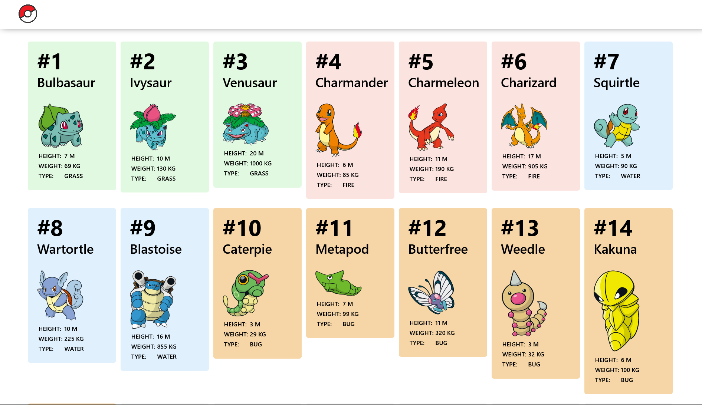
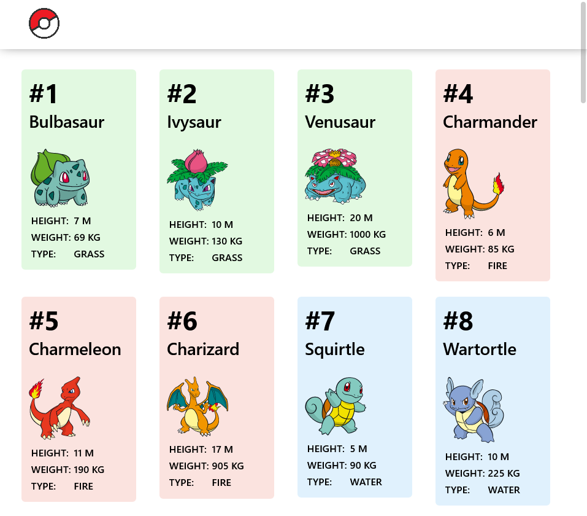
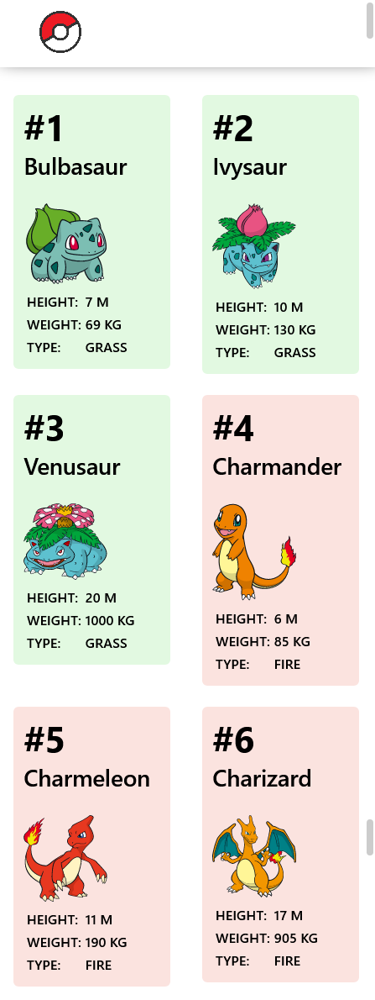

# Pokedex 

Pokedex is created with the help of React.js and Pokedex API. It is an simple application contains top 100 pokemon (on the basis of API) with some information related to that pokemon like height, weight and type.

The application is device-friendly, means you can use it on any device width it is compatible to adjust according to it.

## Technology Used

- HTML
- React.js
- CSS
- API Calling
- JavaScript

## Screenshot

